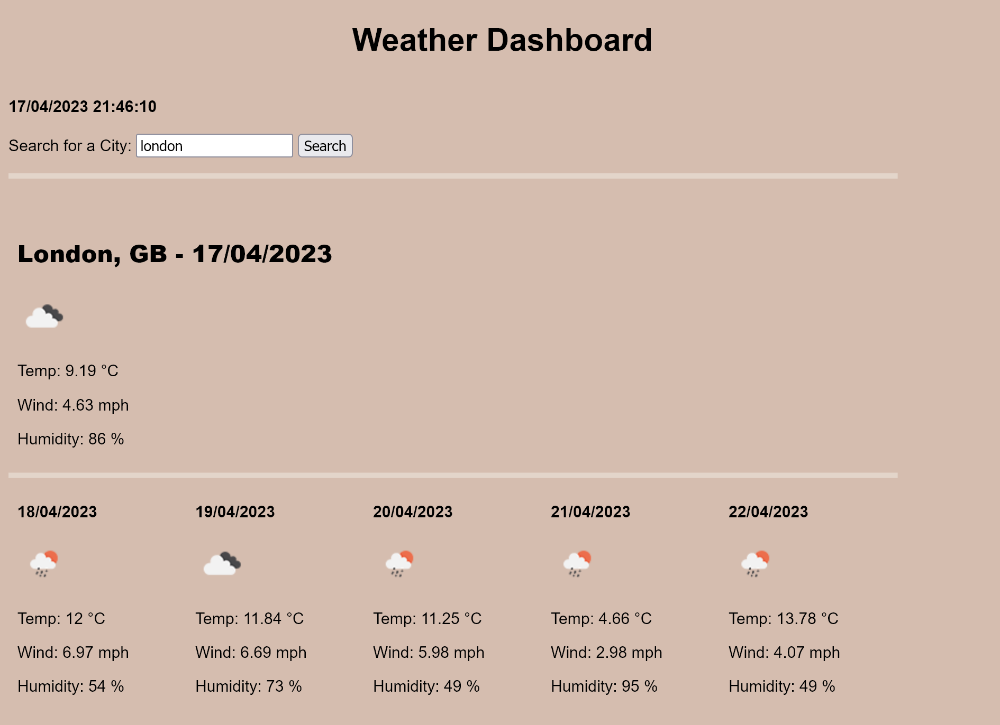

# JC--Weather-Dashboard

## Description

The motivation for this project was to create a weather dashboard application with form inputs that allows a user to search for a city, retrieve its current weather and the next 5-day forecast.

This app runs in the browser, and features dynamically updated HTML and CSS.

 

## Installation

No installation required. 

Application can be accessed through the following URL:
 
https://jeanj22.github.io/JC--Weather-Dashboard/

 

## Usage

The following steps show how the user can navigate the Weather Dashboard application: 

1. When a user searches for a city, they are presented with the current and next 5-day forecast.

2. The default city is set the Birmingham, GB. This is changed once the user performs a city search.

2. Once the user performs a city search they presented with the following information:
- The city name
- The current date
- An icon representation of the weather conditions
- The temperature
- The wind speed
- The humidity

3. The 5-day forecast is displayed below the current day forecast. The 5-day forecast displays the following:  

- The date (for each of the next five days)
- An icon representation of weather conditions
- The temperature
- The wind speed
- The humidity

 

 

## Screenshot of the web application: 
 

JC--Weather-Dashboard-App:

 

## Credits
Resources used:
- https://openweathermap.org/weather-conditions (weather icons)
- https://openweathermap.org

 

## License
N/A

